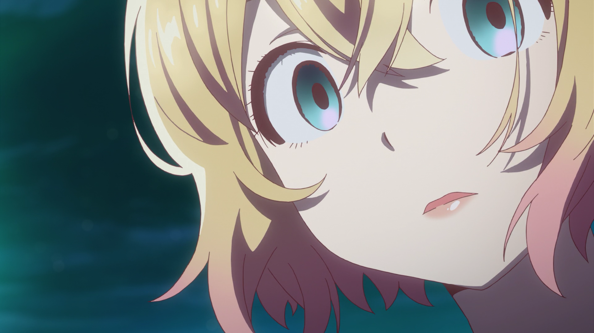
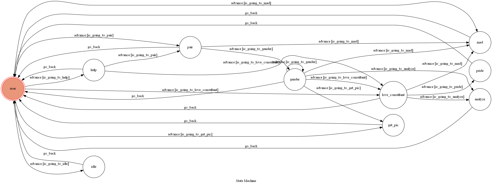
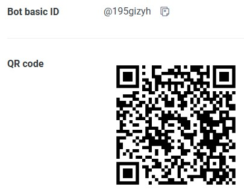
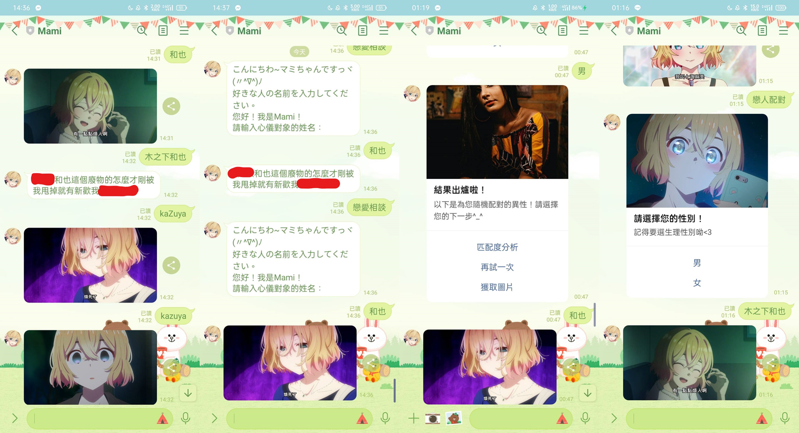

# Line Bot Nanami Mami the Love Consultant

## 角色介紹

### 七海麻美
生日：11月13日  
星座：天蠍座  
聲優：悠木碧  
+ 七海麻美是由宮島禮吏創作的漫畫《出租女友》及其衍生作品的登場角色。  
+ 練馬大學一年級生，曾與木之下和也交往一個月（實際上是隨便答應的），隨後爽快地甩了他。表面上性格爽朗，實際上極度腹黑且善妒。  
+ 是個家教嚴格的大小姊。因為小時候最心愛的娃娃被父親丟棄，以及被迫與喜歡的對象分手，造就了麻美腹黑的性格，**願景是拆散世界上所有的情侶**。  
+ 本作唯一劇情推進擔當，沒有麻美沒有劇情進度，大約140話以後劇情進度開始停滯不前，然而現在已經畫到260幾話了（2022/12/15）

## Finite State Machine

## 加入好友
  
當前狀態：`offline`  
## 功能
* **歡迎訊息**  
  
* **user**
  * 輸入`help`，Mami會貼心的告訴您她提供的服務項目  
  * 輸入`戀愛相談`，Mami會為您進行戀愛諮商
  * 輸入`戀人配對`，Mami會依您的生理性別為您尋找對象，還可以進一步作匹配度分析  
  * 輸入`獲取圖片`，即可以索取前一次`戀人配對`結果的照片
  * 輸入其他指令，Mami會進入*idle*狀態，會隨機回覆一則訊息
* **help**  
  
  * 點選`戀愛相談`，Mami會為您進行戀愛諮商  
  * 點選`戀人配對`，Mami會為您尋找對象  
* **love_consultant** `戀愛相談`  
  * 輸入`戀愛相談`後，再輸入欲匹配之人名，Mami就會幫您算出您與心上人的匹配度  
  * Mami的表情與建議會依匹配度的大小有所變化  
    * 0%：*是我的錯嗎？*  
      
    **不是你的錯，只是對方完全不適合你**  
    * 1~20%：*尷尬卻不失禮的微笑*  
      
    **雖然機率不是0，但還是很低**  
    * 21~40%：*嗯...？*  
      
    **好像還行，但沒有很高**  
    * 41~60%：*嗯！*  
      
    **至少有一半左右的機會了，加油！**  
    * 61~80%：*欸？*  
      
    **這個機會頗高喔，看起來該準備衝一波了**  
    * 81~99%：*恭喜！！！*  
      
    **衝下去就對了，絕對不會後悔！**  
    * 100%：*煩死了...*  
      
    **雖然您看起來是找到適合的對象了，但想要拆散所有情侶的Mami似乎在蠢蠢欲動...**  
  * 同一支帳號輸入同一個名字的結果會相同（左圖於14:29進行測試，右圖於14:31進行測試）  
    
  * 每支帳號的結果皆獨立  
  
    
* **pair** `戀人配對`
  * 輸入`戀愛相談`後，再選擇或輸入您的性別，Mami就會使用**網路爬蟲**幫您尋找一名對象  
    
  * 選擇或輸入`匹配度分析`，Mami會為您與此對象進行*戀愛相談*分析  
    
    * 進行*戀愛相談*分析後，選擇或輸入`再試一次`，戀人配對功能從頭開始  
  * 選擇或輸入`再試一次`，Mami會依據您上次選的性別再次挑選一個對象  
    
  * 無論是否有進行*戀愛相談*分析，選擇或輸入`獲取圖片`，Mami會傳給您此對象之圖片供您下載  
    
  * 當然Mami也會為女性尋找對象  
    
  * 輸入`戀人配對`後，若輸入`男`、`女`以外的回應，Mami會生氣  
    
* **idle** `其他指令`  
  進入*Idle*狀態的Mami會隨機回覆一則訊息（共5種回覆）  
  
## 彩蛋

* **mad**  `和也` `木之下和也` `Kazuya`  
  在任何時候輸入`和也`、`木之下和也`、`Kazuya`，Mami會進入*mad*狀態，會揭露她的本性（共4種回覆，如左圖）  
    
  **（紅色塗鴉為骯髒字眼，慎入！！！）**  
* **pride**  
  在*戀愛相談*狀態時，如果輸入的名字為`麻美`、`七海麻美`、`Mami`、`Nanami Mami`、`まみ`、`ななみまみ`、`マミ`、`ナナミマミ`，Mami會進入*pride*狀態，會狠狠的打槍您（共2種回覆）  
    

* **其他**
  * 相談（そうだん、soudan）為日文「諮詢」的意思  
  * 若前一次服務項目非`戀人配對`，輸入`獲取圖片`時Mami會進入*idle*狀態  
    
  * 幫我測試的朋友的反應  
    
  
> 作者：成功大學資訊工程學系113級 鄭鈞智  
> 最後編輯： 2022/12/26 12:36

